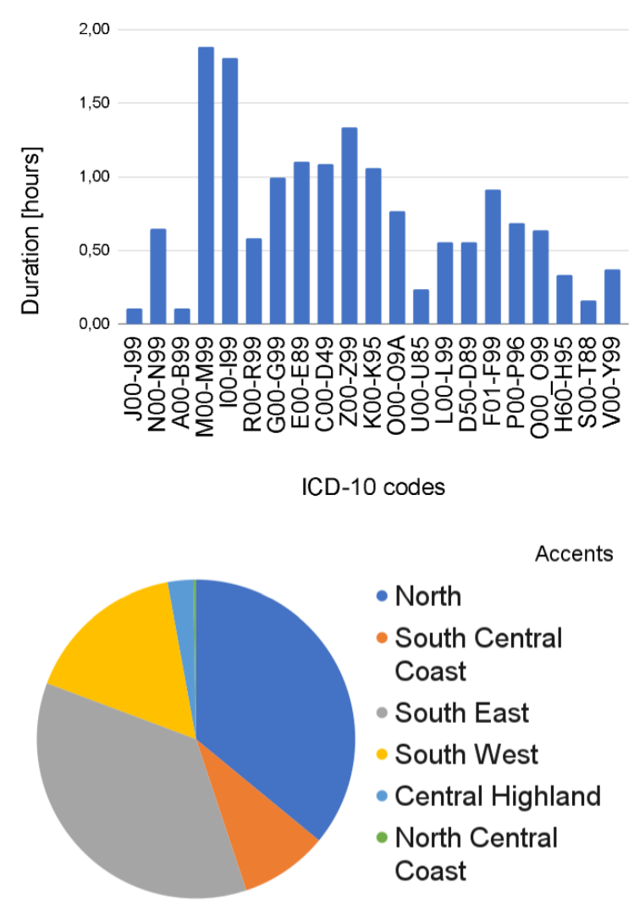

**Guten Tag my comrades👋 I'm Khai**

   

------------------------

I'm currently cooking my 1st year in MASc Biomedical Engineering at University of Toronto (#1 Canada) and UHN (Canada's #1 Hospital).
In the past, I was a Valedictorian at Vietnam National University HCMC (#1 student of #1 Vietnam's Uni), then I was screwed at FH Aachen and RWTH Aachen (Germany's #1 FH and #2 TU). My education background is a mix of Econ, CS and Med.

My research is business-oriented and spans 3 pillars: Speech-Language Processing, Multimodal LLMs, Medical AI. Most of my papers have been commercialized :moneybag:

This psychopath (me) feels grateful to be supervised by: 

- Bachelor thesis: [Prof. Hermann Ney](https://scholar.google.de/citations?user=6C8rf-0AAAAJ&hl=de) (h-index 110), [PD Ralf Schlüter](https://scholar.google.de/citations?user=JmuAC9oAAAAJ&hl=de) (h-index 50)
- Research in industry: [Prof. Truong-Son Hy](https://scholar.google.com/citations?user=JiKBo6UAAAAJ&hl=en) (UChicago), [Prof. Anh Totti Nguyen](https://scholar.google.com/citations?user=EQw8d9AAAAAJ&hl=en) (Auburn), [PhD Nguyen X. Khanh](https://scholar.google.com/citations?user=SmqouhIAAAAJ) (Princeton & UC Berkeley), [Prof. Thanh Nguyen-Tang](https://scholar.google.co.kr/citations?user=UrTlMiwAAAAJ&hl=en) (Johns Hopkins)

I speak Vietnamese, English, German (C1). I lived in Ho Chi Minh City - Vietnam, spent 7 years in Germany, and now in Toronto - Canada. To be a Canadian next year :innocent:

**

Fun facts about me:

**

1. I'm proud to be a prisoner at Nguyễn Khuyến Prison.

2. I once loved a girl for 10 years but our happiness together lasted only 20 months :cry: and she's the only relationship I had - she was in top X of Miss Vietnam (Hoa hậu Việt Nam). Then mama forced me to marry a Miss Business Vietnam (Hoa hậu Doanh nhân Việt Nam) but I escaped just a few days before the wedding :joy: Hope to know what it truly means to love and be loved in the near future :smiling_face_with_three_hearts:.

3. My estimated IQ is modestly ~120-130. I'm a proof of Attitude >= Altitude

4. Most white people think I'm a highschool student. Thanks mom for giving me a cute face!

5. Since I was 3, I spent all of my childhood imprisoned within an orphanage. So all my life, I just wanna scatter light and love across the world - for the happiness I was never given, for the pain never healed in me :kissing_smiling_eyes:

6. Try'na neva lie, neva get angry, neva hurt anybody.

---------------------
## Recent news
- 08.2025 - 🔥Paper accepted at EMNLP 2025🔥: [MultiMed-ST: Large-scale Many-to-many Multilingual Medical Speech Translation](https://arxiv.org/abs/2504.03546) - **120 pages** 🔥

  

- 05.2025 - 🔥Paper accepted at ACL 2025 Industry Track (**Oral**)🔥: [Sentiment Reasoning for Healthcare](https://arxiv.org/abs/2407.21054) (**5 rejections over 1 year** bủh bủh lmao :joy:)

  

- 05.2025 - 🔥Paper accepted at ACL 2025 Industry Track: [MultiMed: Multilingual Medical Speech Recognition via Attention Encoder Decoder](https://arxiv.org/abs/2409.14074) (2 rejections over 9 months)

  

- 02.2025 - 🔥Paper accepted at NAACL 2025 Industry Track: [Medical Spoken Named Entity Recognition](https://arxiv.org/abs/2406.13337) (3 rejections over 1 year :sob:)

<!---

   
   
   
    

-->

#### Airstrike me at:

Email: duckhai.le@mail.utoronto.ca

-------------------

**[HELP ME]: I'm desperately looking for Vietnamese doctors and AI researchers for our large-scale medical AI projects. Feel free to ping me if you want to join.**

## 📄 Selected publications

(*) Equal contribution

#### 2. Real-time Speech Summarization for Medical Conversations
   
**Khai Le-Duc***, Khai-Nguyen Nguyen*, Long Vo-Dang, Truong-Son Hy

[-4C9AFF?style=flat-square)](#)

#### 1. VietMed: A Dataset and Benchmark for Automatic Speech Recognition of Vietnamese in the Medical Domain
   
**Khai Le-Duc**

  

