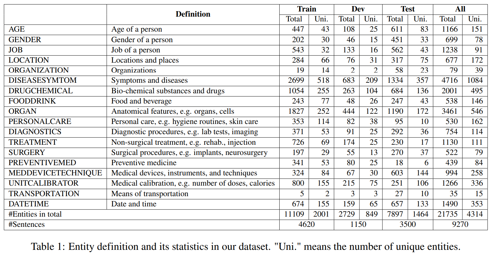

## 📄 Selected publications

(*) Equal contribution

#### 3. Medical Spoken Named Entity Recognition
   
**Khai Le-Duc**, David Thulke, Hung-Phong Tran, Long Vo-Dang, Khai-Nguyen Nguyen, Truong-Son Hy, Ralf Schlüter

  
<em>We introduce VietMed-NER, the first spoken medical NER dataset, featuring 18 distinct medical entity types - the world's largest.</em>

  

    
  

#### 2. Real-time Speech Summarization for Medical Conversations
   
**Khai Le-Duc***, Khai-Nguyen Nguyen*, Long Vo-Dang, Truong-Son Hy

  
<em>We propose the first deployable real-time speech summarization system that generates both local and global summaries, improving user experience while reducing computational costs.</em>

  

    
  

#### 1. VietMed: A Dataset and Benchmark for Automatic Speech Recognition of Vietnamese in the Medical Domain

**Khai Le-Duc**

 

  
<em>We release VietMed, the largest public medical ASR dataset, with models that significantly outperform prior state of the art.</em>

  

    
  

